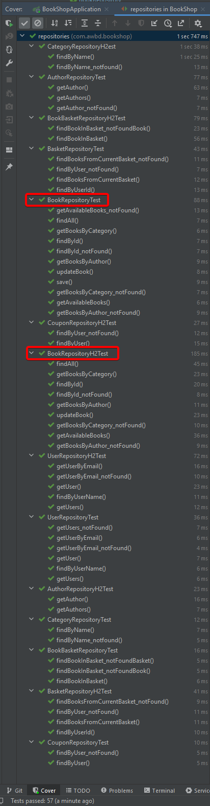

# BookShop

https://docs.google.com/document/d/1DM2_K6RMbRv7PmBai0MUdk9NYFlW_kCtvDij6Wjzn6I/edit?usp=sharing

## Schema

  

## Relationship types

Example of `@ManyToMany`,`@OneToMany`,`@ManyToOne`

  

Example of `@OneToOne`

  

## Switching between profiles 
If you set the active profile to MySQL (mysql), the H2 tests will not fail by default, but they won't run either. The tests annotated with @ActiveProfiles("h2") will be ignored because the active profile is set to MySQL.

To run both MySQL and H2 tests without failing, you need to specify the active profile when running your tests, and ensure that the tests are properly configured to use the corresponding database profile. For example, *if you want to run MySQL tests, you would set the active profile to mysql*. Conversely, *if you want to run H2 tests, you would set the active profile to h2.*

Here's how you can run tests for each profile:

<i>MySQL Tests:</i> 
Set the active profile to MySQL (mysql). 
Run your tests.

<i>H2 Tests:</i> 
Set the active profile to H2 (h2). 
Run your tests.

## Repository tests (mysql and h2)

<b>Present all the tests  
The classes are named after the following logic:  
- ModelNameServiceTest if the tests are made with MySql Profile  
- ModelNameServiceH2Test if the tests are made with H2 Profile
</b>

  

## Unit-tests

<b>Present all the tests on services</b>

  
  

<b>Present all the tests on controller</b>

## Logging
To be able to insert and use logs, the `@Slf4j` annotation is inserted to the h2 test class.

The next step is to display the wnated information using the function `log.info(String)`

The information is display after the test is run in the command prompt

## Paginate and Sorting 

- How it looks in *Repository*

    

- How it looks in *Service* 

    

- How it looks in *Controller* 

- How it looks in *Frontend*